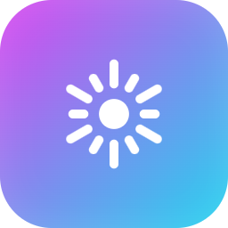

<div align="center">



# NeuralMix Pro

**Mezclador DJ con IA, 100% local. Sin nube, sin telemetría, sin suscripción.**

*AI-powered DJ mixer, 100% local. No cloud, no telemetry, no subscription.*

</div>

---

NeuralMix Pro es un mezclador de DJ de escritorio que se ejecuta **enteramente en tu equipo**. Mantiene el flujo familiar de un software de DJ profesional, pero su diferencia está en el **Co-Pilot de IA** que entiende tu música (armonía, BPM, energía y *similitud de audio real*) y te sugiere qué pinchar después y cómo mezclarlo — algo que ningún otro hace con esta profundidad. Y todo gratis y privado.

## ✨ Funciones

- **Hasta 4 decks** con waveform a color por frecuencia y **jog wheels** con BPM en el centro.
- **Key Lock / Master Tempo** (time-stretch WSOLA): cambia el tempo **sin alterar el tono**.
- **SYNC**, pitch bend, beat jump, brake, hot cues, loops.
- **EQ de 3 bandas + Kill + Filtro + Trim**, crossfader equal-power, master + VU.
- **Faders por stem** (voz / batería / bajo / otros) con separación **Demucs** — corte de voz/acapella al instante.
- **FX**: Echo, Reverb, Flanger, Phaser, Filtro.
- **Sampler / Sound FX**: 8 pads con sonidos de fábrica (Air Horn, Sirena…) + **carga los tuyos**.
- **🤖 Co-Pilot IA**: sugerencias de mezcla armónica + tipo de transición. **AutoMix** que encadena el set solo.
- **Visualizador** reactivo (3 estilos + **webcam de fondo**) para proyección/streaming, con pantalla completa limpia.
- **Biblioteca**: abre **archivos o carpetas** (varias a la vez, con filtro), buscador, análisis automático.
- **Micrófono**, **grabación** del set, **atajos de teclado**.
- **Multilenguaje (ES/EN)**, temas de color, **modo seguro** y respaldo automático.

## 🎛️ Tecnología

- **Electron** (UI) + **Web Audio API** (motor de mezcla en tiempo real, AudioWorklet WSOLA para key-lock).
- **Python** (sidecar local): **librosa** para análisis (BPM / tonalidad Camelot / energía / similitud) y **Demucs** para separación de stems.
- Privacidad absoluta: tu música nunca sale del ordenador.

## ⚖️ Honestidad técnica

NeuralMix está pensado para **casa, práctica, streaming, bares y DJs móviles**. El motor Web Audio tiene una latencia de ~20-50 ms, por lo que **no sustituye una cabina de club profesional** (que requiere <5 ms y hardware dedicado). No incluye vídeo, DMX, timecode de vinilo ni streaming de plataformas de pago — eso pertenece a los ecosistemas comerciales. Aquí prioritzamos un mezclador **local, libre y honesto**, con la mejor inteligencia musical.

## 🚀 Uso (desde código)

```bash
npm install
# entorno de IA (una vez):  python -m venv python/venv  &&  ./python/venv/Scripts/python -m pip install demucs librosa soundfile
npm start
```

## ❤️ Apoya el proyecto

Desarrollado por **Enmanuel Gil** — parte de la suite [OptiSuite](https://optisuite.app). Sin ads ni telemetría.

- ☕ [Ko-fi](https://ko-fi.com/optisuite) · 💛 [Liberapay](https://liberapay.com/OptiSuite.app)
- Binance Pay ID: `1140153333` · USDT (BSC): `0x0a9a0d8d816ede885d1d4a5c94369a72ef86b3c1`

## 📝 Licencia

MIT — ver [LICENSE](LICENSE). Software libre y auditable.
